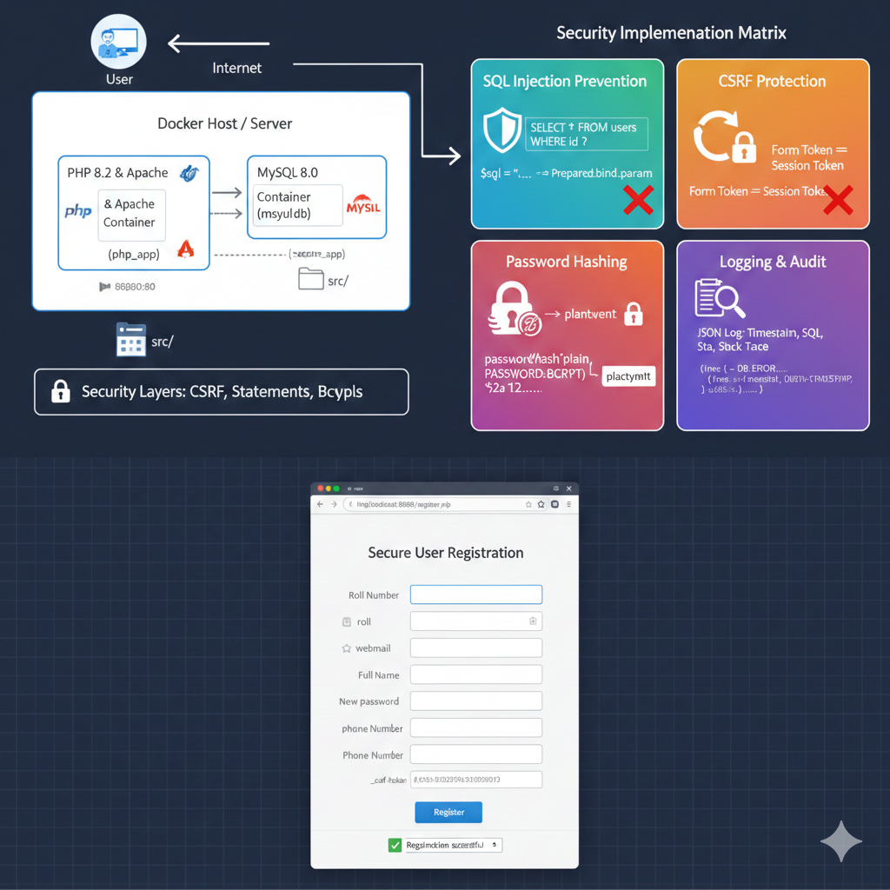

# Technical Project Report: Secure User Registration System

**System Architecture: Dockerized PHP & MySQL**

---

## 1. Executive Summary

This project demonstrates a production-ready, secure user registration system developed using a **procedural PHP** architecture. The primary objective was to implement "Defense in Depth" (multiple layers of security) while maintaining a clean, containerized deployment environment using **Docker**.

### Core Technical Stack

* **Language:** PHP 8.2 (Procedural)
* **Database:** MySQL 8.0
* **Infrastructure:** Docker & Docker Compose
* **Security Layer:** CSRF Tokens, Bcrypt Hashing, Prepared Statements, XSS Filtering

---

## 2. System Architecture

The application follows a modular procedural design where core concerns (Database, Logging, Security) are isolated into separate includes.

### Infrastructure Highlights:

* **Network Isolation:** The MySQL database is not exposed to the host machine. It communicates with the PHP container via a private Docker bridge network, mitigating external brute-force attempts on the database port.
* **Environment Parity:** Docker ensures the development environment exactly matches the production environment, eliminating "it works on my machine" issues.

---

## 3. Database Schema Design

The system uses a normalized relational structure designed for performance and data integrity.

| Field | Type | Constraint | Purpose |
| --- | --- | --- | --- |
| `id` | INT | PRIMARY KEY, AUTO_INCREMENT | Unique Identifier |
| `roll` | VARCHAR(50) | UNIQUE, NOT NULL | Academic/User Identifier |
| `webmail` | VARCHAR(100) | UNIQUE, NOT NULL | Official Communication Email |
| `password` | VARCHAR(255) | NOT NULL | Hashed Credential (Bcrypt) |
| `name` | VARCHAR(100) | NOT NULL | User Full Name |
| `phone` | VARCHAR(15) | NOT NULL | Contact Information |
| `created_at` | TIMESTAMP | DEFAULT CURRENT_TIMESTAMP | Audit Trail / Account Age |

---

## 4. Security Implementation Matrix

The project implements four critical security pillars to protect user data and system integrity.

### 4.1 SQL Injection (SQLi) Prevention

The system enforces a **"No Raw Queries"** policy. All interactions occur through a centralized `db_query()` function that utilizes **MySQLi Prepared Statements**.

* **Mechanism:** SQL logic is pre-compiled on the server; user data is sent later as a literal string.
* **Result:** Malicious SQL commands (e.g., `' OR 1=1 --`) are stored as harmless text rather than executed.

### 4.2 Cross-Site Request Forgery (CSRF) Defense

Every POST request is validated against a unique, cryptographically secure token stored in the user's session.

* **Verification:** If the token provided in the form does not match the session token, the request is instantly killed and logged.

### 4.3 Password Security

Passwords are never stored in plain text. The system uses the **Blowfish (Bcrypt)** algorithm via PHP’s `password_hash()`.

* **Salt:** Automatically managed by the API.
* **Cost Factor:** Tuned to balance server performance with resistance to brute-force/GPU cracking.

### 4.4 Logging & Forensic Audit

A custom `logger.php` records every significant event into a JSON-formatted `app.log`.

* **Captured Data:** Timestamps, File paths, Line numbers, SQL queries, and full Stack Traces in case of errors.

---

## 5. Development Workflow

1. **Containerization:** Configured `docker-compose.yml` to orchestrate PHP and MySQL services.
2. **Configuration:** Centralized settings in `config.php` to handle Docker-specific hostnames (e.g., using `mysql` as the DB host instead of `localhost`).
3. **Core Utilities:** Developed `db.php` and `logger.php` to act as the application's engine.
4. **UI/Logic:** Created `register.php` with integrated form validation and feedback loops.

---

## 6. Conclusion

This project successfully implements a secure, scalable, and auditable registration system. By leveraging Docker and modern PHP security practices, the system remains resilient against common OWASP Top 10 vulnerabilities while providing a lightweight footprint.

---
